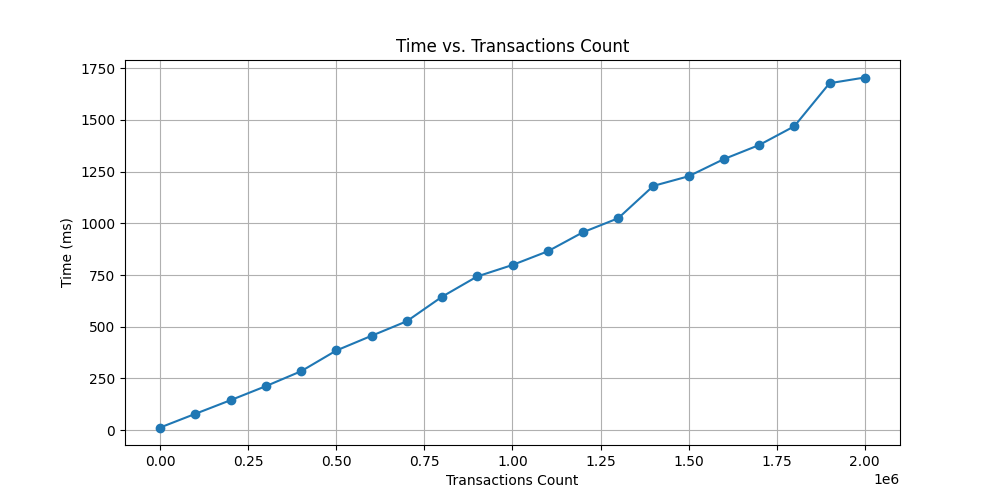
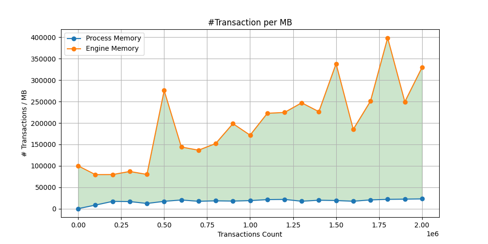

# Transaction Engine

 A Rust-based toy payments engine that processes transactions from a CSV input, updates client accounts,
 handles disputes, resolutions, and chargebacks, and outputs the final state of accounts as a CSV.

## Overview

This project implements a transaction processing system with the following capabilities:
- Processes deposits, withdrawals, disputes, resolutions, and chargebacks.
- Manages client accounts, including available, held, and total funds.
- Handles transaction disputes for both deposits and withdrawals.
- Locks accounts upon chargeback.

### Features

- **CSV Input/Output**: Reads transactions from a CSV file and writes account summaries to stdout in CSV format.
- **Transaction Types**:
  - **`Deposit`**: Increases the available and total funds of an account.
  - **`Withdrawal`**: Decreases the available and total funds if sufficient funds are present.
  - **`Dispute`**: Moves disputed funds from available to held, keeping total funds constant.
  - **`Resolve`**: Moves funds back from held to available, ending a dispute.
  - **`Chargeback`**: Reverses a disputed transaction, reducing total funds and locking the account.
- **Error Handling**: 
  - Comprehensive error checks throughout transaction processing.
  - I/O & Ser/DeSer error handling. 
- **Memory Efficiency**: Processes transactions using stream buffering to manage memory usage even with large datasets.
- **Concurrency Management**: Internal transaction engine state (`accouts` and `transactions_log`) are implemented using [`DashMap`](https://docs.rs/dashmap/latest/dashmap/struct.DashMap.html) to handle (potential) concurrent access efficiently
- **Generalization of Disputes**: Disputes are managed on both `Deposit` and `Withdrawal`.
- **Engine state encoding/decoding**: The `Engine` struct implementing the transaction engine logic is equipped with `load_from_previous_session_csvs` and `dump_transaction_log_to_csvs` functions encode/decode to/from CSV files the internal state (`account` and `transactions_log`).

## Getting Started

### Prerequisites

- Rust (stable)
- Cargo, Rust's package manager

### Installation

```sh
git clone https://github.com/albertogallini/txn_engine.git
cd txn-engine
cargo build --release
```

### Usage
To process a transactions csv file:

```sh
cargo run --release -- transactions.csv > accounts.csv
```

To process a transactions csv file and dump the engine transaction_log:

```sh
cargo run --release -- transactions.csv -dump > accounts.csv
```

For stress testing with internally generated transactions:

```sh
cargo run --release -- stress-test 10000 > accounts.csv
```

Running Tests

```sh
cargo test
```

For stress testing suite to measure time and memory conumption (run `cargo build --release` first):

```sh
./stress-test.sh
```
<i>NOTE: The execution takes longer than the sum of the reported times because the measured elapsed time does not include the time to output and error dumping. </i>

## Implementation Description & Assumptions 

The transaction engine processes transactions from CSV input including deposits, withdrawals, disputes, resolutions, and chargebacks. 
It manages client accounts with available, held, and total balances while supporting batch processing for large datasets to ensure memory efficiency. 
Safe arithmetic operations prevent overflow errors, and it handles disputes for both deposits and withdrawals, with negative holding for the latter
Accounts are locked upon chargeback, and the system provides detailed error reporting. It also includes stress testing capabilities by generating random 
transactions for performance analysis, outputs account statuses to CSV, and leverages Rust's ownership for secure memory management.

### Project Structure

This project consists of several key components, each responsible for different aspects of transaction processing. Below is a schema of the main structs and functions and their interactions within the project.

#### Main Structs

- **`Transaction`**: Represents a financial transaction. Contains fields such as type, client, transaction ID, and amount.
- **`Account`**: Represents a client's account. Manages balances including available, held, and total funds.
- **`Engine`**: Core processing unit that handles transactions, manages accounts, and ensures integrity and correctness of operations.

#### Main.rs Functions

- **`main`**: Parses arguments, distinguishes between `normal processing` and `stress testing`.
- **`process_normal`**: Processes transactions from a provided CSV file and updates account states accordingly.
- **`process_stress_test`**: Handles stress testing by processing a large number of generated transactions and measuring performance metrics.
- **`output_results`**: Outputs the final state of all accounts to a CSV file after processing is complete.

#### utility.rs 

- **`generate_random_transactions`**: Creates a CSV file with randomly generated transactions for stress testing purposes.
- **`generate_deposit_withdrawal_transactions`**: Generates a specified number of random  deposit/withdrawal transactions and writes them to a temporary CSV file for stress testing purposes.
- **`get_current_memory`**:Retrieves the memory usage of the current process.

#### Key Methods in Engine and Complexity Analysis

- **`new`**: Initializes a new engine instance. 
- **`check_transaction_semantic`**: Verifies the semantic validity of transactions, ensuring they adhere to business rules. <i>**Complexity: `O(1)`**</i>
- **`safe_add` / `safe_sub`**: Performs arithmetic operations safely, preventing overflow errors. <i>**Complexity: `O(1)`**</i>
- **`process_transaction`**: Dispatches a transaction to the appropriate processing function based on its type.<i>**Complexity: `O(1)`**</i>
- **`size_of`**: Estimates the memory usage of the engine and its data structures.<i>**Complexity: `O(1)`**</i>
- **`read_and_process_csv_file`**: Reads transactions from a CSV file and use the Engine instane passed as input parameter to processes them. It calls `read_and_process_transactions`.
- **`read_and_process_transactions`**: Reads transactions from a CSV file and dispatches them for processing by the engine.<i>**Complexity: `O(n)`**</i>
- **`load_from_previous_session_csvs`**: Loads transactions (cardinality n) and accounts (cardinality m) from CSV files dumped from a previous session to populate the internal maps.<i>**Complexity: `O(n+m)`**</i> 
- **`dump_transaction_log_to_csvs`**: Dumps the `transaction_log` to a CSV file. <i>**Complexity: `O(n)`**</i>

General Notes about Complexity Analysis:
- The complexity analysis on the `Engine` is exhaustive to evaluate the `txn_engine` process as it includes all the core functionalities.
- The Engine internal state is handled by two DashMaps `accounts` and `transaction_log`. When considering DashMap, operations like insertion, lookup, and removal are generally O(1) in terms of time complexity, thanks to its concurrent hash map implementation. However, under heavy contention or in worst-case scenarios, performance can degrade due to the lock mechanism. See <i>Concurrency Management</i> section.
- CSV Operations: File I/O operations can introduce variability due to disk I/O, but from an algorithmic standpoint, reading or writing each record is considered O(1) per operation.

Here below a simplified diagram of the main structs and relationships:<br>


#### EngineFunctions trait

The EngineFunctions trait provides a set of functions that can be called on the Engine struct. These functions allow clients to interact with the Engine and perform operations such as:

- **deposit**: Deposits a certain amount of funds into a client's account. Implemented by Engine as a call to `process_transaction` with the `Deposit` transaction type.
- **withdraw**: Withdraws a certain amount of funds from a client's account. Implemented by Engine as a call to `process_transaction` with the `Withdrawal` transaction type.
- **dispute**: Disputes a transaction marking it as `disputed`. Implemented by Engine as a call to `process_transaction` with the `Dispute` transaction type.
- **resolve**: Resolves a dispute, releasing the `disputed` transaction. Implemented by Engine as a call to `process_transaction` with the `Resolve` transaction type.
- **chargeback**: Reverses a disputed transaction, effectively removing the associated funds from the client's account and locking the account. Implemented by Engine as a call to `process_transaction` with the `Chargeback` transaction type.

#### Error Handling

The system includes comprehensive error handling with specific error messages for various conditions like insufficient funds, account not found, and transaction disputes.
The system handles the following error conditions:

Semantic errors - error condition on transaction semantic:<br>

- **EngineError::DifferentClient**: If a dispute or resolve is attempted on a transaction from a different client.
- **EngineError::NoAmount**: If a transaction does not have an amount.
- **EngineError::DepositAmountInvalid**: If the amount of a deposit is not greater than 0.
- **EngineError::WithdrawalAmountInvalid**: If the amount of a withdrawal is not greater than 0.
- **EngineError::TransactionRepeated**: If a transaction id already processed in this session - cannot be repeated.
- **EngineError::InsufficientFunds**: If a client does not have enough available funds for a withdrawal.
- **EngineError::AccountNotFound**: If an account is not found for a transaction.
- **EngineError::TransactionNotFound**: If a transaction is not found for a dispute or resolve operation.
- **EngineError::AdditionOverflow**: If an addition operation would result in an overflow.
- **EngineError::SubtractionOverflow**: If a subtraction operation would result in an overflow.
- **EngineError::AccountLocked**: If an account is locked.
- **EngineError::TransactionAlreadyDisputed**: If a dispute is attempted on an already disputed transaction.
- **EngineError::TransactionNotDisputed**: If a resolve or chargeback is attempted on a non-disputed transaction.<br>

I/O Error - deserialization of Engine internal state from a previous session dump<br>
- **EngineSerDeserError::Io**: I/O error while reading a previous session dump.
- **EngineSerDeserError::Csv**: Parsing error while reading a previous session session csv dump
- **EngineSerDeserError::InvalidClientId**: Parsing error while reading a previous session csv -> InvalidClientId
- **EngineSerDeserError::InvalidDecimal**: Parsing error while reading a previous session csv -> InvalidDecimal
- **EngineSerDeserError::InvalidDecimal**: Parsing error while reading a previous session csv -> InvalidBool

when the `txn_engine` is excetued the errors are reported on the stderr in a way it is clear to understand which is the trasaction causing the issue. E.g.:
```
$ txn_engine % cargo run -- tests/transactions_errors.csv -dump > output.csv
  
Error: Some errors occurred while processing transactions:
  - Error reading transaction record: Unknown transaction type: DEPOSIT
  - Error processing Transaction { ty: Deposit, client: 6, tx: 9, amount: Some(0.0000), disputed: false }: Deposit amount must be greater than 0
  - Error processing Transaction { ty: Withdrawal, client: 6, tx: 10, amount: Some(-5.0000), disputed: false }: Withdrawal amount must be greater than 0
  - Error processing Transaction { ty: Deposit, client: 6, tx: 12, amount: Some(5000.0000), disputed: false }: Addition overflow
  - Error processing Transaction { ty: Withdrawal, client: 6, tx: 13, amount: None, disputed: false }: Transaction must have an amount
  - Error processing Transaction { ty: Deposit, client: 7, tx: 14, amount: None, disputed: false }: Transaction must have an amount
  - Error processing Transaction { ty: Deposit, client: 7, tx: 15, amount: Some(10), disputed: false }: Transaction id already processed in this session - cannot be repeated.
  - Error processing Transaction { ty: Dispute, client: 7, tx: 16, amount: None, disputed: false }: Transaction not found
  - Error processing Transaction { ty: Resolve, client: 6, tx: 9999, amount: None, disputed: false }: Transaction not found
  - Error processing Transaction { ty: Chargeback, client: 7, tx: 16, amount: None, disputed: false }: Transaction not found
  - Error processing Transaction { ty: Dispute, client: 7, tx: 15, amount: None, disputed: false }: Transaction already disputed
  - Error processing Transaction { ty: Deposit, client: 7, tx: 17, amount: Some(10), disputed: false }: Account is locked
  - Error processing Transaction { ty: Resolve, client: 8, tx: 18, amount: None, disputed: false }: Transaction not disputed
  - Error processing Transaction { ty: Withdrawal, client: 9, tx: 21, amount: Some(200), disputed: false }: Insufficient funds
  - Error processing Transaction { ty: Dispute, client: 9, tx: 21, amount: None, disputed: false }: Transaction not found

```


#### Memory Efficiency
The engine is designed to be memory efficient, processing transactions through buffering the input csv stream to ensure scalability even with large datasets. See `read_and_process_transactions` in `./src/utility.rs`

#### Concurrency Management
In spite of `./src/main.rs` implementing a single process that reads sequentially from an input CSV stream, the internal `Engine` is designed to support concurrent input transaction streams. Incorporating `DashMap` into the `Engine` struct for managing `accounts` and `transaction_log` provides a concurrent, thread-safe hash map implementation that significantly enhances our system's performance and scalability. <u>By allowing multiple threads to read or write to different entries simultaneously without explicit locking, `DashMap` reduces lock contention: Instead of locking the entire map or individual entries, `DashMap` uses fine-grained locking internally (i.e sharded locking'), reducing contention when many threads are accessing different parts of the data map. It improves memory efficiency, and simplifies the codebase, making it easier to manage concurrent operations across potentially thousands of client transactions</u>. This choice supports the goal of creating a high-throughput, low-latency transaction processing system that can scale with demand, all while maintaining code maintainability.<br>

- Benefits of [`DashMap`](https://docs.rs/dashmap/latest/dashmap/struct.DashMap.html):
  - Concurrency:
    - Lock-Free Reads: DashMap uses a lock-free approach for reading operations, allowing multiple threads to read from the map concurrently without blocking each other.
    - Fine-Grained Locking for Writes: When writing, DashMap uses a sharded approach where only the specific shard containing the key is locked, reducing contention compared to locking the entire map.
  - Performance:
    - High Throughput: By minimizing locking, DashMap can achieve higher performance, especially in read-heavy scenarios or when dealing with a large number of keys across multiple threads.
    - Scalability: Performance scales well with the number of cores, as more threads can work on different parts of the map concurrently.
  - Ease of Use:
    - Familiar API: DashMap provides an API very similar to HashMap, making it easier for developers familiar with HashMap to transition or use interchangeably in many cases.
    - Iterator Support: It supports iterators, including those that are safe for concurrent use (iter()), which simplifies working with map data in a thread-safe manner.   

See also `test_engine_consistency_with_concurrent_processing` test case in `/tests/test.rs`

#### Generalization of Disputes:
- Deposits: When disputing a deposit, you would move the disputed amount from available to held. This keeps the total the same since you're just reallocating the funds.
- Withdrawals: When disputing a withdrawal, the process is similar but with a twist: the amount held would indeed be <i>negative</i> because it represents money that was taken out (withdrawn) from the account but is now under dispute. Holding a negative amount means you're reserving the possibility that this withdrawal could be reversed, effectively increasing the account's available balance by this negative (or positive in terms of adding back) amount while the dispute is unresolved. Details:

  - For a Disputed Deposit:
    - Available: Decreases by the disputed amount.
    - Held: Increases by the disputed amount.
    - Total: Remains unchanged.
 
  - For a Disputed Withdrawal:
    - Available: Increases by the disputed amount (since you're essentially holding back the withdrawal).
    - Held: Decreases by the disputed amount (negative held).
    - Total: Remains unchanged because you're just moving what was taken out back into a different category (held).

  - Allowing for negative held funds for withdrawals means that if the dispute results in a resolve, you'd decrease the held (which is negative) and increase available, effectively returning the withdrawn money back into available funds.
   For a chargeback, you'd reduce the total by the (negative) held amount, which means adding the disputed withdrawal back to the account, but since the account is then locked, this might require special handling for accounting or regulatory purposes.

- There is no check on the available amount before applying a `Dispute`: disputing a `Deposit` occurred before  a `Withdrawal` may lead to a negative available fund.
- It is not possible to dispute multiple times the same transaction. This is prevented by the `disputed` flag in the `Transaction` struct.
- It is not possible to resolve a non-disputed transaction. Again, this is prevented by the `disputed` flag in the `Transaction` struct.

NOTE on **locked** account: Once an account is locked, no further actions are possible. Neither the `Engine` nor `EngineFunctions` expose APIs to unlock the account. The only possible way to unlock it is through offline methods (i.e., manual intervention) on the account storage, followed by loading the `txn_engine` from a previously generated and modified dump (see the next section).

Implementation: see `fn check_transaction_semantic` and `impl EngineFunctions for Engine` in `./src/engine.rs`

## Engine state encoding/decoding:
The `-dump` command line parameter will cause the `Engine` to dump the entire content of the internal `transaction log` to CSV file (in addition to the accounts on the standard output). The file will be written in the current working directory.

This is useful for debugging and testing since it allows you to save the state of the engine after running a set of transactions and then load it back up for further testing or verification.
The `accounts` and `transactions_log` fields are serialized/deserialized using their `serde` implementations.
The `accounts` field is a `dashmap::DashMap<ClientId, Account>`.
The `transactions_log` field is a `dashmap::DashMap<TransactionId, Transaction>`.
The `serde` module is used to serialize/deserialize the `dashmap`s.

Once you have obtained the account dump (returned on the standard output) and the transaction log dump by using the `-dump` cli parameter, it is possible to use those files to decode the Engine internal status.
This is possible only through internal APIs (see `load_from_previous_session_csvs` Engine function and `test_serdesr_engine` ) and not exposed as a cli parameter. 
This function is useful to easily test some edge cases that are not possible if the internal state of an `Engine` is built by the `read_and_process_transactions` Engine function that executes all the semantic checks on the 
transactions. 
`load_from_previous_session_csvs` is much faster than `read_and_process_transactions` as there is no semantic check. It is a blind decoding of the internal Engine maps dump. For this reason, it 
is a very dangerous functionality and if used in production (e.g.: to quickly restore an instance of the service without reading the entire transaction history since inception), it must be guaranteed 
the input files have not been modified after being created by the process. 
Furthermore, to use such a functionality in a production environment, the dumped files should be equipped with metadata about the creation time and encoder versioning and logic (to handle the ser/deser backward compatibility with further txn_engine releases).
A possible scenario to use this functionality is to store every day - at the end of the day - the snapshot of account and transaction log. So if the next day a txn_engine has to be restarted it can load from the yesterday snapshot and then reconstruct the 
correct current status loading just the transactions of the current day. Which is computationally sustainable: see performance analysis in the next section.

- Reasons to use serde:
  - CSV to Struct: when reading from CSV, you might want to directly convert each row into a Transaction struct.
  Serde can automatically map CSV fields to struct fields if you use the #[derive(Deserialize)] attribute on your structs.

  - Struct to CSV: when writing back to CSV, Serde can serialize your structs back into CSV format,
  ensuring that data integrity is maintained without manual string formatting.

  - Consistent Data Handling: using Serde ensures that data is consistently formatted when both reading
  from and writing to files, which reduces errors in data representation.

  - Extensibility: if you later decide to store or transmit data in a different format
  (like JSON for API responses, or binary formats for efficiency), Serde can handle these conversions
  without changing your core data structures. This makes your code more adaptable to changes in data storage or transmission methods

  On a separate note: loading the previous session state is important to prevent duplicate transactions across sessions.

## Stress Test script & performance measure:

The stress_test.sh script runs the program with increasing numbers of transactions and measures execution time and memory consumption. 
The `generate_random_transactions` function is used by the `stress-test` mode of the `txn_engine` to generate random transactions in the CSV format. It takes in two parameters: the number of transactions to generate and the output file path.

The function works as follows:
- It opens the output file using the provided path.
- It writes the header line to the file with the column names.
- For each transaction, it randomly selects a type (deposit, withdrawal, dispute, resolve, chargeback), a client ID between 1 and 1.000.000 and a transaction id between 1 and 10.000.000
- For deposit and withdrawal transactions, it generates a random amount between 0.0 and 100.0000.0.
- It writes each transaction line to the file.
- Then it loops from 100 to 1000100 transactions in steps of 100 and measures the time and memory consumption of the program. The output is written to stress_test_results.txt in the format `Transactions Count, Time, Process Memory (MB), Engine Memory (MB)`.

Note: The `generate_random_transactions` function is not meant to mimic real-world transactions since it generates random transactions without any ordering or dependencies. This results in a <b>higher number of error conditions</b> compared to real-world use cases and as a consequence the number of entry in both the `transaction_log` and `account` maps will be lower than real-world use case. But it is good enough to see how the system resources are used increasing the size of the input.

Example of output on Mac-Book M3 24 Gb :
```
Transactions Count   Time                 Process Memory (MB)  Engine Memory (MB)  
100                  12.415125ms          0.344                0.001               
100100               184.069ms            13.000               1.250               
200100               341.112375ms         16.875               2.505               
300100               518.024ms            25.141               3.734               
400100               811.506709ms         24.219               2.314               
500100               964.680375ms         41.125               3.919               
600100               1.25693025s          39.625               2.065               
700100               1.324102583s         39.656               6.174               
800100               1.528267083s         51.016               7.493               
900100               1.86784925s          55.781               4.246               
1000100              2.015164458s         59.672               4.988                      
         
```





So overall performance of txn_engine, on the aformenthioned assumption, on this machine is `~500.000 transactions/s`  with a avg `~[15.000 (Process Memory) - 150.000 (Engine Memory)] transation/Mb` memory impact on the user account/transaction log storage.
The plots also show that both time and memory scale as O(n).<br><br>
Comments:
-  Read the comment of `Engine.size_of` function to see how the Engine Memory is computed. The Engine size does not take into account the data structure overhead.
-  The Process Memory takes into account the entire process memory footprint, including the Rust runtime and the memory allocation for the I/O and other data structures: this explains the big difference with the Engine memory measures.
-  The Process Memory is controlled by the runtime and the OS, so it is more volatile.
-  The Engine Memory is not only dependent on the number of input transactions but also by the amount of errors (e.g. too big withdrawal or dispute on invalid tx id) that affects the Engine internal maps size.
-  So it is legitimate to have a big discrepancy for the #transaction/MB estimate Process Memory vs Engine Memory, but the fact that it is ~constant over time respect to the process memory footprint suggests the implementation of txn_engine does not degrade with input size.
