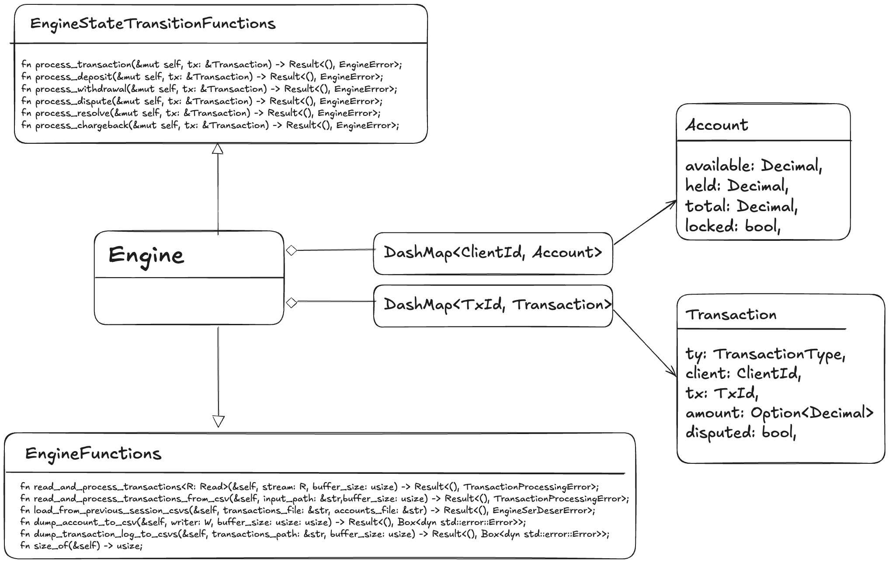
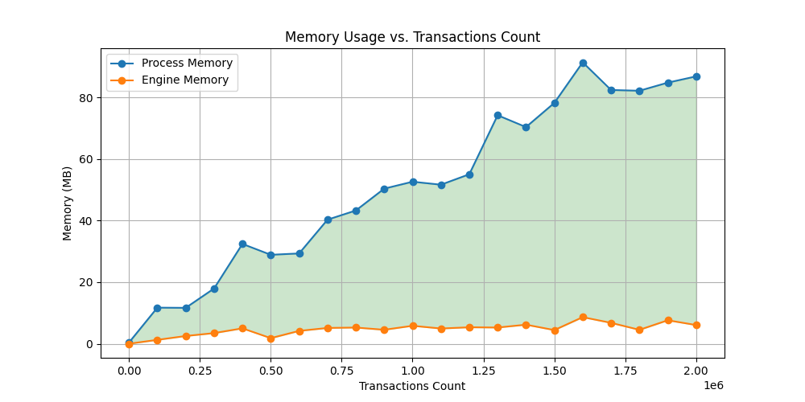

# Transaction Engine

 A Rust-based toy payments engine that processes transactions from a CSV input, updates client accounts,
 handles disputes, resolutions, and chargebacks, and outputs the final state of accounts as a CSV.

## Overview

This project implements a transaction processing system with the following capabilities:
- Processes deposits, withdrawals, disputes, resolutions, and chargebacks.
- Manages client accounts, including available, held, and total funds.
- Handles transaction disputes for both deposits and withdrawals.
- Locks accounts upon chargeback.
- There are **two** transaction processeing engines. The first -`Engine`- is synchronous and built on top of `DashMap` which implements a sharded locked Hashmap, The second -`AsycEngine`- is asynchronosu and built on topo of custom Hasmap, `ShardedRwLockMap` that supports sharded locking, but, differently form DashMap offers asyc non blocking apis (insert/entry/iterators etc.. ) 
- There are **two** distinct transaction processing engines, differentiated primarily by their concurrency model and underlying data structures.
    - The **Synchronous Engine (`Engine`)** is synchronous and built on top of **`DashMap`**. **`DashMap`** is a **high-performance, community-standard concurrent hash map** designed for use in **synchronous, multi-threaded environments**. It implements a **sharded locking mechanism**. This approach optimizes **lock granularity**, significantly **reducing contention** between threads and maximizing parallelism. 
    - The **Asynchronous Engine (`AsyncEngine`)** is **asynchronous** and built on top of a **custom sharded hash map**, **`ShardedRwLockMap`**. This custom map also supports sharded locking but, critically, offers **asynchronous, non-blocking APIs** (e.g., `insert`, `entry`, `iterators`) by leveraging **`tokio::sync::RwLock`**. This is must be used in scenarios requiring **high concurrency** and **low-latency I/O** within a single application process, typically under an asynchronous runtime (like Tokio).

**⚠️ NOTE:** This documentation refers mainly to  `Engine` to describe the architecture and behaviour. `AsycEngine` replicates the logic of `Engine` just offering asyc api. Whenever there is a reference to the async engine, a relevant difference in the beaviour and/or in the implications of using an async logic, the ⚠️ symbol is used. Furthermore,  [Asyc VS Sync performance assesment](./asyncvssync.md) document has been added to report the performance assesment of using an async engine vs a sync one. 


### Features

- **CSV Input/Output**: Reads transactions from a CSV file and writes account summaries to stdout in CSV format.
- **Transaction Types**:
  - **`Deposit`**: Increases the available and total funds of an account.
  - **`Withdrawal`**: Decreases the available and total funds if sufficient funds are present.
  - **`Dispute`**: Moves disputed funds from available to held, keeping total funds constant.
  - **`Resolve`**: Moves funds back from held to available, ending a dispute.
  - **`Chargeback`**: Reverses a disputed transaction, adjusting the total and the held funds accordingly and locking the account.
- **Error Handling**: 
  - Comprehensive error checks throughout transaction processing.
  - I/O & Ser/DeSer error handling. 
- **Memory Efficiency**: Processes transactions using stream buffering to manage memory usage even with large datasets.
- **Concurrency Management Sync Version**: Internal transaction engine state (`accouts` and `transactions_log`) are implemented using [`DashMap`](https://docs.rs/dashmap/latest/dashmap/struct.DashMap.html) to handle concurrent access efficiently.
- **⚠️ Concurrency Management Async Version**: The async version works similarly to the the Sync version but relying on `ShardedRwLockMap` instead of `DashMap`.
- **Generalization of Disputes**: Disputes are managed on both `Deposit` and `Withdrawal`.
- **Engine state serialization/deserialization**: The `Engine` struct implementing the transaction engine logic is equipped with `load_from_previous_session_csvs`,`dump_account_to_csv` and `dump_transaction_log_to_csvs` functions serialize/deserialize to/from CSV files the internal state (`account` and `transactions_log`).
- **⚠️  Async Engine state serialization/deserialization**: The `AsyncEngine` exposes the same apis, but uses `tokio::task::spawn_blocking` to run the CSV parsing in a separate thread and a channel to communicate between the threads. This allows the engine to process transactions concurrently with the parsing, improving performance.

## Getting Started

### Prerequisites

- Rust (stable)
- Cargo, Rust's package manager

### Installation

```sh
git clone https://github.com/albertogallini/txn_engine.git
cd txn-engine
cargo build
```
or, for optimized binary:

```
cargo build --release
```

### Usage
To process a transactions csv file:
```sh
# Sync mode (default)
cargo run  -- transactions.csv > accounts.csv
```
```sh
# Async mode
cargo run --  async transactions.csv > accounts.csv
```
or, for optimized binary:
```sh
# Sync mode (default)
cargo run --release -- transactions.csv > accounts.csv
```
```sh
# Async mode 
cargo run --release -- async transactions.csv > accounts.csv
```

To process a transactions csv file and dump the engine transaction_log:

```sh
# Sync mode (default)
cargo run -- transactions.csv -dump > accounts.csv
```
```sh
# Async mode 
cargo run -- async transactions.csv -dump > accounts.csv
```

For stress testing with internally generated transactions (`release` mode is more appropriate here):

```sh
# Sync mode (default)
cargo run --release -- stress-test 10000 > accounts.csv
```

```sh
# Async mode 
cargo run --release -- async stress-test 10000 > accounts.csv
```

Running Tests

```sh
cargo test
```

For stress testing suite to measure time and memory conumption:

```sh
./stress-test.sh
```

```sh
# Async mode 
./stress-test.sh async
```

## Implementation Description & Assumptions 

The transaction engine processes transactions from CSV input including deposits, withdrawals, disputes, resolutions, and chargebacks and outputs account statuses to CSV.
It manages client accounts with available, held, and total balances. Accounts are locked upon chargeback transactions.
Safe arithmetic operations prevent overflow errors, and it handles disputes for both deposits and withdrawals. Futhermore the system provides detailed error reporting.
It also includes stress testing capabilities by generating random transactions for performance analysis.

### Project Structure

This project consists of a set of key components, each responsible for different aspects of transaction processing. Below is a schema of the main structs and functions and their interactions within the project.

#### Data Structures (`Structs`):

- **`Transaction`**: Represents a financial transaction. Contains fields such as type, client, transaction ID, and amount.
- **`Account`**: Represents a client's account. Manages balances including available, held, and total funds.
- **`Engine`**: Core processing unit that handles transactions, manages accounts, and ensures integrity and correctness of operations.

#### Main Project Files:

- **`main.rs`**
  - **`main`**: Parses arguments, distinguishes between `normal processing` and `stress testing`.
  - **`process_normal`**: Processes transactions from a provided CSV file and updates account states accordingly.
  - **`process_stress_test`**: Handles stress testing by processing a large number of generated transactions and measuring performance metrics.

- **`utility.rs`** 
  - **`generate_random_transactions`**: Creates a CSV file with randomly generated transactions for stress testing purposes.
  - **`generate_random_transaction_concurrent_stream`**: Generates a specified number of random transactions suitable for concurrency and writes them to a temporary CSV file for testing concurrency on `Engine` insances.
  - **`get_current_memory`**:Retrieves the memory usage of the current process.

- **`engine.rs`**
  - Main Methods in `Engine` and its implementation of `EngineFunctions` and `EngineStateTransitionFunctions` traits:
    - **`read_and_process_transactions_from_csv`**: Reads transactions from a CSV file and processes them. It calls `read_and_process_transactions`. ***Complexity: time `O(n)`, memory space`O(n)`***
    - **`read_and_process_transactions`**: Reads transactions from a input stream and dispatches them for processing by the engine. ***Complexity: time `O(n)`, memory space`O(n)`***
    - **`load_from_previous_session_csvs`**: Loads ***n*** transactions and ***m*** accounts  from CSV files dumped from a previous session to populate the internal maps. ***Complexity: `O(n+m)`, memory space`O(n+m)`*** 
    - **`process_transaction`**: Dispatches a transaction to the appropriate processing function based on its type. ***Complexity: `O(1)`, memory space`O(1)`*** 
    - **`check_transaction_semantic`**: Verifies the semantic validity of transactions, ensuring they adhere to business rules. ***Complexity: `O(1)`, memory space`O(1)`***
    - **`dump_transaction_log_to_csv`**: Dumps the `transaction_log` to a CSV file. ***Complexity: `O(n)`, memory space`O(1)` as uses buffering***
    - **`dump_account_to_csv`**: Outputs the final state of all accounts to a CSV file after processing is complete. ***Complexity: time `O(m)`, memory space`O(1)` as uses buffering***
    - **`safe_add` / `safe_sub`**: Performs arithmetic operations safely, preventing overflow errors. ***Complexity: `O(1)`, memory space`O(1)`***
    - **`size_of`**: Estimates the memory usage of the engine and its data structures. ***Complexity: `O(1)`, memory space`O(1)`***

  - General Notes about ***Complexity Analysis***:
    - The complexity analysis on the `Engine` is exhaustive to evaluate the `txn_engine` process as it includes all the core functionalities.
    - The Engine internal state is handled by two DashMaps `accounts` and `transaction_log`. When considering DashMap, operations like insertion, lookup, and removal are generally O(1) in terms of time complexity. However, under heavy contention or in worst-case scenarios, performance might degrade due to the locking mechanism. See *Concurrency Management* section.
    - CSV Operations: File I/O operations can introduce variability due to disk I/O, but from an algorithmic standpoint, reading or writing each record is considered O(1) per operation.

- **⚠️ `asycengine.rs`**
   - `AsycEngine` is equivalent to `Engine` in terms of exposed apis and complexity analysis.

#### `EngineFunctions` and `EngineStateTransitionFunctions` traits:

The separation of public and private functions in the `Engine` struct is achieved using two distinct traits: `EngineFunctions` for public APIs and `EngineStateTransitionFunctions` for internal state management, which enhances clarity, reduces complexity, and improves security by preventing unintended modifications.

  - The `EngineFunctions` trait provides the following **public** methods to interact with the Engine and operates on the internal state:
    - **`read_and_process_transactions`**: Reads transactions from a stream and processes them.
    - **`read_and_process_transactions_from_csv`**: Reads transactions from a CSV file and processes them using `read_and_process_transactions`.
    - **`load_from_previous_session_csvs`**: Loads transactions and accounts from CSV files dumped from a previous session to populate the internal maps. (This functionality is public but not exposed as command line pramenter)
    - **`dump_transaction_log_to_csv`**: Dumps the `transaction_log` to a CSV file.
    - **`dump_account_to_csv`**: Outputs the final state of all accounts to a CSV file after processing is complete.

  - The `EngineStateTransitionFunctions` trait provides a set of functions that can be called on the `Engine` struct **internally**. These functions are not public and  allow clients to interact with the Engine and perform operations such as:
    - **`process_transaction`**: To handle common actions across all the transactions type and dispach to specifc methods.
    - **`process_deposit`**: Deposits a certain amount of funds into a client's account.
    - **`process_withdraw`**: Withdraws a certain amount of funds from a client's account. 
    - **`process_dispute`**: Disputes a transaction marking it as `disputed`. 
    - **`process_resolve`**: Resolves a dispute, releasing the `disputed` transaction. 
    - **`process_chargeback`**: Reverses a disputed transaction, effectively removing the associated funds from the client's account and locking the account.

**⚠️ NOTE:** `AsyncEngine` exposes exaclty the same functions and extends equivalente Async traits : `AsycEngineStateTransitionFunctions` and `AsyncEngineFunctions`

Here below a simplified diagram of the main structs and relationships:<br>


**⚠️ NOTE:** `AsyncEngine` architecture replicates the same relationship diagram but uses: 
  - the trait `AsycEngineStateTransitionFunctions` in place of `EngineStateTransitionFunctions`
  - the trait `AsyncEngineFunctions` in place of `EngineFunctions`
  - `ShardedRwLockMap` in place of the `DashMap`.

### Error Handling

The system includes comprehensive error handling with specific error messages for various conditions like insufficient funds, account not found, and transaction disputes.
The system handles the following error conditions:

Semantic errors - error conditions on transaction semantic:<br>

- **EngineError::DifferentClient**: If a dispute/resolve/chargeback is attempted on a transaction from a different client.
- **EngineError::NoAmount**: If a deposit/withdrawal transaction does not have an amount or referred transaction (e.g. from a dispute) does not have an amount.
- **EngineError::DepositAmountInvalid**: If the amount of a deposit is not greater than 0.
- **EngineError::WithdrawalAmountInvalid**: If the amount of a withdrawal is not greater than 0.
- **EngineError::TransactionRepeated**: If a transaction id already processed in this session - cannot be repeated.
- **EngineError::InsufficientFunds**: If a client does not have enough available funds for a withdrawal.
- **EngineError::AccountNotFound**: If an account is not found for a withdrawwal/dispute/resolve/chargeback transaction. Deposit transaction (with valid amount) will create a new account.
- **EngineError::TransactionNotFound**: If a transaction is not found for a dispute, resolve or chargeback operation.
- **EngineError::AdditionOverflow**: If an addition operation would result in an overflow.
- **EngineError::SubtractionOverflow**: If a subtraction operation would result in an overflow.
- **EngineError::AccountLocked**: If an account is locked any type of transaction return this error.
- **EngineError::TransactionAlreadyDisputed**: If a dispute is attempted on an already disputed transaction.
- **EngineError::TransactionNotDisputed**: If a resolve or chargeback is attempted on a non-disputed transaction.<br>

I/O Error occurring during sereliazion/deserialization<br>
- **EngineSerDeserError::Io**: I/O error while reading a previous session dump.
- **EngineSerDeserError::Csv**: Parsing error while reading a previous session session csv dump
- **EngineSerDeserError::InvalidClientId**: Parsing error while reading a previous session csv -> InvalidClientId
- **EngineSerDeserError::InvalidDecimal**: Parsing error while reading a previous session csv -> InvalidDecimal
- **EngineSerDeserError::InvalidDecimal**: Parsing error while reading a previous session csv -> InvalidBool

when the `txn_engine` is executed the errors are reported on the ***stderr*** in a way it is clear to understand which is the trasaction causing the issue. E.g.:
```
$ txn_engine % cargo run -- tests/transactions_errors.csv -dump > output.csv
  
Error: Some errors occurred while processing transactions:
  - Error reading transaction record: Unknown transaction type: DEPOSIT
  - Error processing Transaction { ty: Deposit, client: 6, tx: 9, amount: Some(0.0000), disputed: false }: Deposit amount must be greater than 0
  - Error processing Transaction { ty: Withdrawal, client: 6, tx: 10, amount: Some(-5.0000), disputed: false }: Withdrawal amount must be greater than 0
  - Error processing Transaction { ty: Deposit, client: 6, tx: 12, amount: Some(5000.0000), disputed: false }: Addition overflow
  - Error processing Transaction { ty: Withdrawal, client: 6, tx: 13, amount: None, disputed: false }: Transaction must have an amount
  - Error processing Transaction { ty: Deposit, client: 7, tx: 14, amount: None, disputed: false }: Transaction must have an amount
  - Error processing Transaction { ty: Deposit, client: 7, tx: 15, amount: Some(10), disputed: false }: Transaction id already processed in this session - cannot be repeated.
  - Error processing Transaction { ty: Dispute, client: 7, tx: 16, amount: None, disputed: false }: Transaction not found
  - Error processing Transaction { ty: Resolve, client: 6, tx: 9999, amount: None, disputed: false }: Transaction not found
  - Error processing Transaction { ty: Chargeback, client: 7, tx: 16, amount: None, disputed: false }: Transaction not found
  - Error processing Transaction { ty: Dispute, client: 7, tx: 15, amount: None, disputed: false }: Transaction already disputed
  - Error processing Transaction { ty: Deposit, client: 7, tx: 17, amount: Some(10), disputed: false }: Account is locked
  - Error processing Transaction { ty: Resolve, client: 8, tx: 18, amount: None, disputed: false }: Transaction not disputed
  - Error processing Transaction { ty: Withdrawal, client: 9, tx: 21, amount: Some(200), disputed: false }: Insufficient funds
  - Error processing Transaction { ty: Dispute, client: 9, tx: 21, amount: None, disputed: false }: Transaction not found

```
**⚠️ NOTE:** `AsyncEngine` uses exactly the same errors. 

### Memory Efficiency
The engine is designed to be memory efficient, processing transactions through buffering the input csv stream to ensure scalability even with large datasets. See `read_and_process_transactions` in `./src/engine.rs`

### Concurrency Management & input streams (`std::io::Read`)
#### Sync Version 
In spite of `./src/main.rs` implementing a single process that reads sequentially from an input CSV stream, the internal `Engine` is designed to support concurrent input transaction streams. Incorporating `DashMap` into the `Engine` struct for managing `accounts` and `transaction_log` provides a thread-safe implementation. <u>By allowing multiple threads to read or write to different entries simultaneously without explicitly locking, `DashMap` reduces lock contention: instead of locking the entire map or individual entries, `DashMap` uses fine-grained locking internally (i.e *sharded locking*), reducing contention when many threads are accessing different parts of the data map. It simplifies the codebase, making it easier to manage concurrent operations across  many of client transactions</u>. This choice supports the goal of creating a high-throughput, low-latency transaction processing system that can scale with demand, all while maintaining code maintainability.<br>

NOTES:
- Benefits of [`DashMap`](https://docs.rs/dashmap/latest/dashmap/struct.DashMap.html):
  - Concurrency:
    - Lock-Free Reads: DashMap uses a lock-free approach for reading operations, allowing multiple threads to read from the map concurrently without blocking each other.
    - Fine-Grained Locking for Writes: When writing, DashMap uses a sharded approach where only the specific shard containing the key is locked, reducing contention compared to locking the entire map.
  - Performance:
    - High Throughput: By minimizing locking, DashMap can achieve higher performance, especially in read-heavy scenarios or when dealing with a large number of keys across multiple threads.
    - Scalability: Performance scales well with the number of cores, as more threads can work on different parts of the map concurrently.
  - Ease of Use:
    - Familiar API: DashMap provides an API very similar to HashMap, making it easier for developers familiar with HashMap to transition or use interchangeably in many cases.
    - Iterator Support: It supports iterators, including those that are safe for concurrent use (iter()), which simplifies working with map data in a thread-safe manner.   

 -  the `read_and_process_transactions` menthod in the `EngineFunctions` (and its impelmentation in `Engine`) offers the necessary abstraction 
 to process a generic input stream (`std::io::Read`) efficienlty by leveraging on buffering to avoid high memory consumption.
 
 -  To have consistent results processing concurrently multiple transactions streams, the streams:
    - must have disjoint client id ranges. This is also related to scalabilty, see also the notes about *sharding* in ***Stress Test script & performance measure*** section.
    - must have disjoint transaction id ranges.

    Conversely, a transaction of stream A may affect the account of a client on stream B, and - as the concurrent execution cannot guarantee the order of the transaction processing - this 
    leads to non-deterministic account balance values. Or, simply, a transaction may fail as another with the same id has been already processed, leading to non-deterministic 
    outcomes as well. See also `generate_random_transaction_concurrent_stream` in `./src/utility.rs` and `reg_test_engine_consistency_with_concurrent_processing` test case
    in `/tests/test.rs`.

- Input stream abstraction (i.e. the `std::io::Read` trait) is good for reusability as we can pass to `read_and_process_transactions` whatever input source implements `std::io::Read` e.g.:

  - file streams
    ```
    use std::fs::File;

    let file_path = "path/to/your/file.csv";
    let file = File::open(file_path).expect("Failed to open file");
    let engine = Engine::new();
    engine.read_and_process_transactions(file, 16_384).expect("Failed to process transactions from file");

    ```

  - tcp streams
    ```
    use std::net::TcpStream;

    let address = "127.0.0.1:8080";
    let stream = TcpStream::connect(address).expect("Failed to connect to server");
    let engine = Engine::new();
    engine.read_and_process_transactions(stream, 16_384).expect("Failed to process transactions from TCP stream");
    ```

  - kafka streams (with a wrapper implementation)
    ```
    struct KafkaReadWrapper<'a> {
        consumer: &'a StreamConsumer,
    }

    impl<'a> Read for KafkaReadWrapper<'a> {
        fn read(&mut self, buf: &mut [u8]) -> std::io::Result {
            ...
    ```

    and 

    ```
    {
        // Configure a Kafka consumer
        let consumer: StreamConsumer = ClientConfig::new()
            .set("bootstrap.servers", "localhost:9092")
            .set("group.id", "my-group")
            .create()
            .expect("Failed to create consumer");

        consumer.subscribe(&["your-topic"]).expect("Failed to subscribe to topic");

        let engine = Engine::new();
        let mut kafka_reader = KafkaReadWrapper::new(&consumer);

        // Now you can pass the KafkaReadWrapper to the read_and_process_transactions method
        engine.read_and_process_transactions(&mut kafka_reader, 16_384)?;

        Ok(())
    }
    ```
#### ⚠️ Async Version

The **`AsyncEngine`** operates functionally in **exactly** the same way as the sync **`Engine`**, but **relies** on **`ShardedRwLockMap`** which **exposes** async methods. This **allows** to build the same logic but **completely** `async`. This can be beneficial **whenever** you want to use the transaction engine in a context where many (+thousands) of concurrent events have to be managed by the engine on the same node. This **allows** to avoid **spawning** a separate **OS thread** for each event (e.g., connection), which would lead to **performance degradation and system instability** due to the volume of concurrent threads.

While the **Dash map** still **protects** from **contention** and **locking thrashing**, the major implications in this scenario are:

1.  **Context Switching Overhead:** The OS scheduler must pause execution of one thread (save its state/registers) and resume execution of another.
2.  **Memory Consumption:** Every OS thread requires a dedicated block of memory for its stack. Default stack sizes (often 1-2 MB) are multiplied by the number of threads.


Architecture, interfaces and api exposed by `AsyncEngine` are exactly the same of `Engine`. See also [Asyc VS Sync performance assesment](./asyncvssync.md)


### Generalization of Disputes:
- Deposits: When disputing a deposit, you would move the disputed amount from available to held. This keeps the total the same since you're just reallocating the funds.
- Withdrawals: When disputing a withdrawal, the process is similar but with a twist: the amount held would indeed be *negative* because it represents money that was taken out (withdrawn) from the account but is now under dispute. Holding a negative amount means we are reserving the possibility that this withdrawal could be reversed, effectively increasing the account's available balance by this negative (or positive in terms of adding back) amount while the dispute is unresolved. Details:

  - For a Disputed Deposit:
    - Available: Decreases by the disputed amount.
    - Held: Increases by the disputed amount.
    - Total: Remains unchanged.
 
  - For a Disputed Withdrawal:
    - Available: Increases by the disputed amount (since you're essentially holding back the withdrawal).
    - Held: Decreases by the disputed amount (negative held).
    - Total: Remains unchanged.

  - Allowing for negative held funds for withdrawals means that if the dispute results in a resolve, you'd increase the held (which is negative) and decrease available. For a chargeback, you'd reduce the total by the (negative) held amount, which means adding the disputed withdrawal back to the account and then the account is locked (according to the chargeback logic).

- There is no check on the available amount before applying a `Dispute`: disputing a `Deposit` occurred before  a `Withdrawal` may lead to a negative available fund.
- It is not possible to dispute multiple times the same transaction. This is prevented by the `disputed` flag in the `Transaction` struct.
- It is not possible to resolve a non-disputed transaction. Again, this is prevented by the `disputed` flag in the `Transaction` struct.

NOTE on **locked** account: Once an account is locked, no further actions are possible. Neither the `Engine`/`AsyncEngine` nor `EngineFunctions`/`AsyncEngineFuntions` expose APIs to unlock the account. The only possible way to unlock it is through offline methods (i.e.: manual intervention) on the account storage, followed by loading the `txn_engine` from a previously generated and modified dump (see the next section).

Implementation: see `fn check_transaction_semantic` and `impl EngineFunctions for Engine` in `./src/engine.rs` or equivalent methods in `./src/asyncengine.rs`. ⚠️ This logic is the same for both sync and async engine.


### Engine state serialization/deserialization:
The `-dump` command line parameter will cause the `Engine` to dump the entire content of the internal `transaction log` to CSV file (in addition to the accounts on the standard output). The file will be written in the current working directory.

This is useful for debugging and testing since it allows you to save the state of the engine after running a set of transactions and then load it back up for further testing or verification.
The `accounts` and `transactions_log` fields are serialized/deserialized using their `serde` implementations.
The `accounts` field is a `dashmap::DashMap<ClientId, Account>`.
The `transactions_log` field is a `dashmap::DashMap<TransactionId, Transaction>`.
The `serde` module is used to serialize/deserialize the `dashmaps`.

Once  the account dump (returned on the standard output) and the transaction log dump by using the `-dump` command line parameter have been obtained, it is possible to use those files to rebuild (i.e. deserialize) the `Engine` internal status.
This is possible only through internal APIs (see `load_from_previous_session_csvs` Engine function and `test_serdesr_engine` ) and not currenlty exposed as a command line parameter. 
This function is useful to easily test some edge cases that are not possible if the internal state of an `Engine` is built by the `read_and_process_transactions` `Engine` function that executes all the semantic checks on the 
transactions. E.g. see `unit_test_subrtaction_overflow` test case.<br>
`load_from_previous_session_csvs` is much faster than `read_and_process_transactions` as there is no semantic check. It is a *blind* decoding of the internal Engine maps dump. For this reason, it 
is a potentially dangerous functionality and if used in production (e.g.: to quickly restore an instance of the service ***without reading the entire transaction history since inception***), it must be guaranteed 
the input files have not been modified after being created by the process (e.g. using hashing)<br>
Furthermore, to use such a functionality in a production environment, the dumped files should be equipped with metadata about the creation time and encoder versioning and logic (to handle the ser/deser backward compatibility with further txn_engine releases).<br>
A possible scenario to use this functionality is to store every day - at the end of the day - the snapshot of accounts and transactions log. So if the next day a txn_engine has to be restarted it can load from the yesterday snapshot and then reconstruct the 
correct current status loading just the transactions of the current day. Which is computationally sustainable: see performance analysis in the next section.

`load_from_previous_session_csvs` uses default BufReader buffering size.  

Reasons to use serde:
  - CSV to Struct: when reading from CSV, you might want to directly convert each row into a `Transaction` or `Account` struct.
  Serde can automatically map CSV fields to struct fields if you use the #[derive(Deserialize)] attribute on your structs.

  - Struct to CSV: when writing back to CSV, Serde can serialize your structs back into CSV format,
  ensuring that data integrity is maintained without manual string formatting.

  - Consistent Data Handling: using Serde ensures that data is consistently formatted when both reading
  from and writing to files, which reduces errors in data representation.

  - Extensibility: if you later decide to store or transmit data in a different format
  (like JSON for API responses, or binary formats for efficiency), Serde can handle these conversions
  without changing your core data structures. This makes your code more adaptable to changes in data storage or transmission methods

**⚠️ NOTE:** Ser/deser is typically a blocking tasks. See [Asyc VS Sync performance assesment](./asyncvssync.md) to check how the deserialization of csv has been managed in an asyc workflow. In particular the section **Benefits of using channels during the async CSV parsing**.

## Stress Test script & performance measure:

The `stress_test.sh` script runs the program with increasing numbers of transactions and measures execution time and memory consumption. 
The `generate_random_transactions` function is used by the `stress-test` mode of the `txn_engine` to generate random transactions in the CSV format. It takes in two parameters: the number of transactions to generate and the output file path.

- The `generate_random_transactions` function works as follows:
  - It opens the output file using the provided path.
  - It writes the header line to the file with the column names.
  - For each transaction, it randomly selects a type (deposit, withdrawal, dispute, resolve, chargeback), a client ID between 1 and 1.000.000 and a transaction id between 1 and 10.000.000
  - For deposit and withdrawal transactions, it generates a random amount between 0.0 and 100.000.
  - It writes each transaction line to the file.
- The main in the `stress-test` mode then writes the measure on the standard output in the format `Transactions Count, Time, Process Memory (MB), Engine Memory (MB)`, followed by the accounts dump.
- The `stress_test.sh` script  loops from 100 to 2.000.100 transactions in steps of 100.000 and capture the measures at each iteration. It returns a table like:

  ```
  Transactions Count   Time                 Process Memory (MB)  Engine Memory (MB)  
  100                  12.87825ms           0.391                0.001               
  100100               79.222833ms          11.719               1.258               
  200100               145.160667ms         11.656               2.509               
  300100               212.871209ms         17.938               3.452               
  400100               285.000875ms         32.422               4.999               
  500100               385.176666ms         28.891               1.813               
  600100               456.288333ms         29.328               4.168               
  700100               526.671791ms         40.297               5.125               
  800100               645.112125ms         43.281               5.254               
  900100               743.275667ms         50.375               4.533               
  1000100              798.600791ms         52.625               5.826               
  1100100              864.674375ms         51.656               4.940               
  1200100              956.779917ms         55.047               5.343               
  1300100              1.024538625s         74.219               5.261               
  1400100              1.181045458s         70.375               6.182               
  1500100              1.227557875s         78.234               4.434               
  1600100              1.310450292s         91.406               8.635               
  1700100              1.3783415s           82.422               6.778               
  1800100              1.469251375s         82.172               4.515               
  1900100              1.677349042s         84.812               7.616               
  2000100              1.705031125s         86.844               6.066                       
          
  ```
  ***[on Mac-Book-Air M3 24 Gb in a VSCode terminal window]***<br><br>
  From which we can get the following charts:<br>
  
  
  

Note: The `generate_random_transactions` function is not meant to mimic real-world transactions since it generates random transactions without any ordering or dependencies. This results in a <b>higher number of error conditions</b> compared to real-world use cases and as a consequence the number of entry in both the `transaction_log` and `account` maps will be lower than real world use case. But it is good enough to see how the system resources are used increasing the size of the input, especially to check if there is a trend that is not coeherent with the complexity analysis. `generate_random_transaction_concurrent_stream` would provide a transactions stream closer to the real world use case, but has it has an internal state that would affect the process memory footprint.
The best approach would be to generate the transactions offline and process them with `txn_engine`, but we kept the transaction generation in-process for simplicity.

In reference to the above table, the performance of txn_engine, on the aforementioned assumption, on this machine is ~`1.200.000 transactions/s` with an average `~[17.000 (Process Memory) - 200.000 (Engine Memory)] transactions/MB` memory impact on the user account/transaction log storage.
The plots also show that both time and memory scale as O(n).

**⚠️NOTE:** See [Async VS Sync performance assessment](./asyncvssync.md) for a comparison between `Engine` abn `AsyncEngine`.

### Notes & Comments
-  The Engine size (`Engine.size_of`) does not take into account the data structure overhead. Please read the comment of `Engine.size_of` for more detalis.
-  As the transactions are generated randomly, the error rate can be quite high, which affects the size of the maps. As the error rate is high the  maps grow slower than a real use case.
-  The `Process Memory` takes into account the entire process memory footprint, including the Rust runtime, the memory allocation for the I/O and other data structures: this explains the big differences with the `Engine Memory` measures.
-  The `Process Memory` is controlled by the runtime and the OS, so it is more volatile.
-  Errors are **not** returned to stderr in stress-test (`process_stress_test`) mode. However, in a common use case, where transactions are not generated randomly, the error rate is much lower, so -in spite of being retunred on the stderr- this should not affect the reliability of the measurements. Additionally, stderr can be redirected to memory (e.g.:`$()` in a shell script) or to a file in normal (`process_normal`) mode.
-  Having a lower `Engine Memory` size in a test with higher number of transaction in the input stream is possible. It depends on the error rate generated by the randomly generated transactions.
-  So it is legitimate to have a big discrepancy for the #transactions/MB estimate Process Memory vs Engine Memory.

### Scalability

- Assumptions
  - Considering ~17.000 transactions/MB  (`Process Memory (MB)`/`#Transactions`): <br>
    *17.000 x 1024 x 64 Gb  = 1.114.112.000 transactions (i.e. ~**1B**)*<br>
    can be managed on a commodity machine equipped with 64Gb. So **sharding the client Ids across multiple nodes** and making them sticky to a specific node (e.g. using consistent hashing) with a farm of N commodity nodes we can  manage N Billions transactions in terms of memory footprint. 
  - 200 transactions per client per day (which is a very high value)
  - ~17.000 transactions/MB estimanted value could be higher than in a real world use case because of the high error rates generated by `generate_random_transactions`. In this analysis we compensate that assuming 200 transactions per client per day. 
  - In a production enviroment a reasonable assumption is that we can discard (i.e. not loading in the `transaction_log` anymore) transactions older than a certain number of days (**K**), as we won't allow disputes on transactions older than that, otherwise the memory will grow indefinitely. If a dispute for a transaction older than K days is received, it will simply discarded.
  - Assuming K = 30 days. Also this is quite high value.
  - In a production enviroment the engine processes should be restarted regularly (e.g.: every day): at each restart the process should load from previous session.

- The solution scales horizontally as follows
  - 200 x 30 days  = 6.000 transactions per client per period have to be stored
  - 1B / 6.000 =  166.666 = ~166.000 (for simplicity) clients per machine.
  - We can add a node increasing throughput and without sacrificing latency, e.g.: a farm with 100 64Gb nodes can manage 16.6 M clients.
  - NOTE: `pub type ClientId = u16` should be moved to `u32` or `u64` as `u16` can only represent 65536 clients.


- The solution scales vertically as follows
  - increase the node memory will allow to manage more clients per node. e.g.: 256 Gb memory will allow to manage 16.6 x 4 =~ 66 M clients (which is in line with the # of customers of biggest retail banks on earth)

 **⚠️ Important Note: Async vs Sync impact on scalabilty ⚠️**:

  - Under the current assumptions, **both the Async and Sync engines work equally well**. The peak concurrency is ~166,000 clients / (30 × 24 × 3600 s) ≈ **0.06 threads per second** per node. A sync engine running on a small, statically-sized thread pool is more than sufficient. The peak is mainly bounded to the memory usage, mainly dominanted by the storage of transactions in memory. This is required as both engines check if the **transaction id is valid** (i.e. NOT duplicated).

  - Conversely, if the system is **designed skip the transaction validity check so avoiding to keep the transaction log in memory** (the main contributor to memory footprint) and **only load old transactions on demand** (e.g., when a dispute occurs — which is much rarer than deposits/withdrawals), memory usage per node drops dramatically. In this scenario, we can support **much higher concurrency**, and an **Async engine becomes necessary** to handle thousands of concurrent network clients efficiently.

  - Currently, **neither the Async nor Sync engine supports runtime log flushing/loading**. The `load_from_previous_session_csvs` function is blocking and intended only for startup. Even the async version is effectively blocking in this context. To support real-time flushing/loading, we would need a **channel + dedicated background thread** with a producer/consumer pattern — exactly like the one used in `AsyncEngine::read_and_process_transactions`.

  - Additionally, as said, every method currently enforces **transaction ID uniqueness within a session** (defined as the **K**-day dispute window). This limits maximum throughput. To achieve significantly higher transactions-per-second rates, we should **remove the session-wide uniqueness check** and assume transaction IDs are globally unique by design (or validated upstream).


#### Consideration about persistency and caching: 
In a real-world solution, it's important to store and keep the `Engine` state persistent on disk or in a database to recover the status in case of a crash. Additionally, the `Engine` could keep only the most active users in memory by ***implementing a caching logic***. This will reduce the process memory footprint, allowing more clients per node.<br>
As all the transaction types modify the account balance, consistency is critical, and the most suitable caching writing logic is `Write Through`: every write to the cache is immediately written to the persistent storage, ensuring data consistency, but at the cost of performance.

## Regression and Unit Tests

All the tests are contained in `./test/test.rs` and are divided into unit test (focus on specific functions and cases) and regressions tests (coverig the broad functionalities to ensure some changes does not brek the logic). 
Here's a bullet-point list of the functions the test suite with brief descriptions.

### Unit tests: 
1. **`unit_test_deposit_and_withdrawal`**: Tests basic deposit and withdrawal functionalities, ensuring correct balance updates.
2. **`unit_test_deposit_and_dispute`**: Verifies that disputes correctly move funds from available to held balances.
3. **`unit_test_dispute_deposit_after_withdrawal`**: Checks the behavior when disputing a deposit after a withdrawal, ensuring held funds are calculated correctly.
4. **`unit_test_double_dispute`**: Tests the engine's handling of multiple disputes on the same transaction, ensuring only one dispute affects the account.
5. **`unit_test_txid_reused_after_dispute_and_resolve`**: Ensures that a transaction ID cannot be reused after it has been disputed and then resolved, expecting an error for repeated transaction IDs.
6. **`unit_test_deposit_and_dispute_resolve`**: Tests the sequence of deposit, dispute, and resolve to ensure funds revert back to available after resolution.
7. **`unit_test_deposit_and_dispute_chargeback`**: Verifies that a chargeback locks an account and removes the disputed amount from both held and total balances.
8. **`unit_test_deposit_withdrawal_dispute_withdrawal`**: Checks if disputing a withdrawal correctly adjusts the account balance.
9. **`unit_test_deposit_withdrawal_too_much`**: Ensures that a withdrawal exceeding available funds fails and no change occurs to the account balance.
10. **`unit_test_deposit_negative`**: Tests the engine's response to a negative deposit amount, expecting an error.
11. **`unit_test_withdrawal_negative`**: Checks that a negative withdrawal amount is rejected with an appropriate error.
12. **`unit_test_withdrawal_from_zero`**: Verifies that attempting to withdraw more than the account balance results in an "Insufficient funds" error.
13. **`unit_test_addition_overflow`**: Tests the handling of arithmetic overflow during deposit, expecting an addition overflow error.
14. **`unit_test_decimal_precision`**: Ensures correct handling of decimal precision in transactions, including rounding effects.
15. **`unit_test_subrtaction_overflow`**: Checks if the engine handles subtraction overflow correctly during a dispute operation.

NOTE: unit tests should use directly the `EngineStateTransitionFunctions` api implemented by the `Engine`  and skip `read_and_process_transactions_from_csv`, but the deserialization logic here is simple enough that using it makes the 
tests more readable as we can write the input directly in the test code as CSV.

### Regression tests:
1. **`reg_test_from_csv_file_basic`**: Processes transactions from a CSV file to test basic functionality with multiple accounts.
2. **`reg_test_from_csv_file_disputed`**: Tests dispute and chargeback operations from CSV file input, ensuring correct account states post-transaction.
3. **`reg_test_from_csv_file_error_conditions`**: Tests the handling of several erroneous transactions from a CSV file
4. **`reg_test_from_csv_file_malformed`**: Tests that processing a CSV file with malformed records results in the expected errors
5. **`reg_test_load_from_previous_session_csv`**: Tests loading transactions and accounts from CSV files into the `Engine` nad verifiy the content is correct.
6. **`reg_test_serdesr_engine`**: Tests the correctness of serialization and deserialization of the `Engine` to and from CSV files
7. **`reg_test_engine_consistency_with_concurrent_processing`**: Test that the engine produces consistent results even when processing transactions concurrently.

 **⚠️ The same unit/regression tests have been replicated for the async enging**